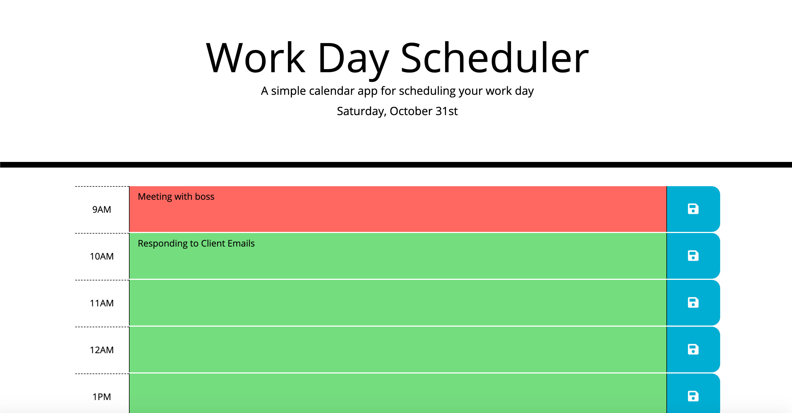

# Calendar App

## About

This is a simple calendar application that allows the user to write in all the tasks they need to accomplish throughout the day.  The time slots include the hours in a normal work day and each slot changes color depending on the current time.  If a time slot is grey, that means that time has already passed.  If a time slot is red, that means that is the current time.  If a time slot is green, that means it has not occured yet.  This website also uses local storage to allow the user to exit and return to the site or reload the site and not lose thier changes.  

The program can be viewed live using the link below.

 "Calendar App")
